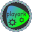

## Description



Playork is a Collection of Some Simple Tools and Games.

Application is in beta the 'adding games','README.md modification' and 'contact page in app' are in work you will also see some bugs it will tka some time to release first version.

## Install

if you want to try it install nodejs,git and clone this repository

```bash
 git clone https://github.com/Playork/Playork
```
point to source directory

```bash
 cd /path/to/source/Playork
```

and install depencise by

```bash
 npm install
```

after this start this application by this command

```bash
 npm start
```
## Licence

MIT License (MIT)

Copyright (c) 2018 Playork

Permission is hereby granted, free of charge, to any person obtaining a copy of this software and associated documentation files (the "Software"), to deal in the Software without restriction, including without limitation the rights to use, copy, modify, merge, publish, distribute, sublicense, and/or sell copies of the Software, and to permit persons to whom the Software is furnished to do so, subject to the following conditions:

The above copyright notice and this permission notice shall be included in all copies or substantial portions of the Software.

THE SOFTWARE IS PROVIDED "AS IS", WITHOUT WARRANTY OF ANY KIND, EXPRESS OR IMPLIED, INCLUDING BUT NOT LIMITED TO THE WARRANTIES OF MERCHANTABILITY, FITNESS FOR A PARTICULAR PURPOSE AND NONINFRINGEMENT. IN NO EVENT SHALL THE AUTHORS OR COPYRIGHT HOLDERS BE LIABLE FOR ANY CLAIM, DAMAGES OR OTHER LIABILITY, WHETHER IN AN ACTION OF CONTRACT, TORT OR OTHERWISE, ARISING FROM, OUT OF OR IN CONNECTION WITH THE SOFTWARE OR THE USE OR OTHER DEALINGS IN THE SOFTWARE.
